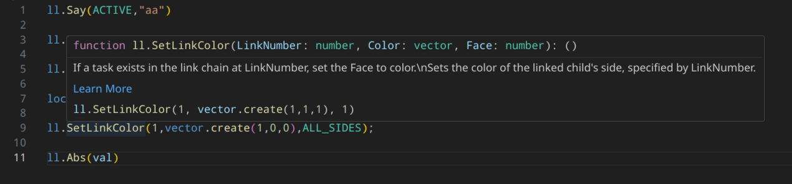

## [Types for luau-lsp for lua in Second Life](https://slua.wlf.io)

Visit https://slua.wlf.io for documentation and static links for latest
downloads.

See [here](https://wiki.secondlife.com/wiki/Luau_Alpha) and
[here](https://wiki.secondlife.com/wiki/Lua_FAQ) for more information about lua
in secondlife.



Created with plenty of help and original findings from
[@gwigz](https://github.com/gwigz)

<sub>This project is not associated with [Linden Lab](https://lindenlab.com/)
any use of trademarks or copyrighted terms (like `Second Life`) is done in good
faith to explain clearly what this project is for, and not an attempt to
misrepresent</sub>

## VSCode installation

### With [SL External Editor](https://marketplace.visualstudio.com/items?itemName=wlf-io.sl-external-editor) extension

- Install
  [SL External Editor](https://marketplace.visualstudio.com/items?itemName=wlf-io.sl-external-editor)
  extension
- Install
  [Luau Language Server](https://marketplace.visualstudio.com/items?itemName=JohnnyMorganz.luau-lsp)
  extension
- Install
  [Selene](https://marketplace.visualstudio.com/items?itemName=Kampfkarren.selene-vscode)
  extension
- Enable the SL External Editor extension for your workspace with the
  `> SL External Editor: Enable` command
- Definitions should automatically update
  - They can be manually updated with the
    `> SL External Editor: Update LSP Defs` command

### Manual installation without extension

Download a `sl_lua_types.zip` from
[here](https://github.com/WolfGangS/sl_lua_types/releases/latest) and extract

#### Setup Snippets

- Copy the `luau.code-snippets` file to your workspaces `.vscode` folder

#### Setup luau-lsp (Inline type checks, code completion, some linting)

Work is happening to add support for setting urls for definitions in the vscode
extension, to allow automatic updating of the definitions. For now you will need
to update them manually. When they change

1. Install vscode
2. Install
   [this](https://marketplace.visualstudio.com/items?itemName=JohnnyMorganz.luau-lsp)
   extension ([github link](https://github.com/JohnnyMorganz/luau-lsp))
3. Extract and place those files somewhere memorable (`<user_dir>/.sl-luau/` for
   instance)
4. Then Either globally or in your project add the 2 files to the options with
   the following config

   ```JSON
   "luau-lsp.types.definitionFiles": [
       "~/.sl-luau/ll.d.luau"
   ],
   "luau-lsp.types.documentationFiles": [
       "~/.sl-luau/ll.d.json"
   ],
   "luau-lsp.platform.type": "standard"
   ```

   or through the UI

5. You may need to restart vscode or reload the ui

#### Setup Selene (linting)

1. Install
   [this](https://marketplace.visualstudio.com/items?itemName=Kampfkarren.selene-vscode)
   extension to vscode ([github link](https://github.com/Kampfkarren/selene))
2. Add the the `sl_selene_defs.yml` to your project
   - if you choose to put it in a folder rather than the project root you will
     need to edit the `std` entry in the toml to reflect that
3. Copy the provided `selene.toml` to the root of your project or write your own
   with a format similar to this
   ```TOML
   std = "sl_selene_defs"

   [rules]
   global_usage = "allow"
   shadowing = "allow"

   [config]
   empty_if = { comments_count = true }
   unused_variable = { ignore_pattern = "^_|^touch_start$|^touch_end$|^touch$" }
   ```
4. Selene should pick this up and start giving you linting hints.

### Recommendations

- The extension
  [Error Lens](https://marketplace.visualstudio.com/items?itemName=usernamehw.errorlens)
  for inline errors
  ([github link](https://github.com/usernamehw/vscode-error-lens))
