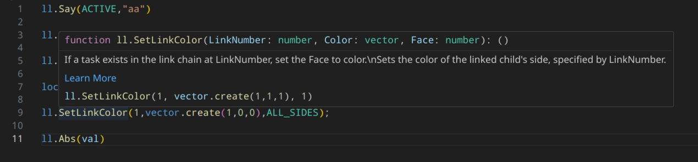

## Types for luau-lsp for lua in secondlife

See [here](https://wiki.secondlife.com/wiki/Luau_Alpha) and
[here](https://wiki.secondlife.com/wiki/Lua_FAQ) for more information about lua
in secondlife.



Created with plenty of help and original findings from
[@gwigz](https://github.com/gwigz)

## VSCode installaion

### Setup luau-lsp (Inline type checks, code completion, some linting)

Work is happening to add support for setting urls for definitions in the vscode
extension, to allow automatic updating of the definitions. For now you will need
to update them manually. When they change

1. Install vscode
2. Install
   [this](https://marketplace.visualstudio.com/items?itemName=JohnnyMorganz.luau-lsp)
   extension ([github link](https://github.com/JohnnyMorganz/luau-lsp))
3. Download a `sl_lua_types.zip` from
   [here](https://github.com/WolfGangS/sl_lua_types/releases/latest)
4. Extract and place those files somewhere memorable (`<user_dir>/.sl-luau/` for
   instance)
5. Then Either globaly or in your project add the 2 files to the options with
   the following config

   ```JSON
   "luau-lsp.types.definitionFiles": [
       "~/.sl-luau/ll.d.luau"
   ],
   "luau-lsp.types.documentationFiles": [
       "~/.sl-luau/ll.d.json"
   ],
   "luau-lsp.platform.type": "standard"
   ```

   or through the UI

6. You may need to restart vscode or reload the ui

### Setup Selene (linting)

1. Install
   [this](https://marketplace.visualstudio.com/items?itemName=Kampfkarren.selene-vscode)
   extension to vscode ([github link](https://github.com/Kampfkarren/selene))
2. Add the the `sl_selene_defs.yml` to your project (Suggest :
   `./types/sl_selene_defs.yml`)
3. Create a `selene.toml` in the root of your project with the following content
   ```TOML
   std = "types/sl_selene_defs"

   [rules]
   global_usage = "allow"
   shadowing = "allow"

   [config]
   empty_if = { comments_count = true }
   unused_variable = { ignore_pattern = "^_|^touch_start$|^touch_end$|^touch$" }
   ```
4. Selene should pick this up and start giving you linting hints.

### Recommendations

- [this](https://marketplace.visualstudio.com/items?itemName=usernamehw.errorlens)
  Extension for inline errors
  ([github link](https://github.com/usernamehw/vscode-error-lens))
